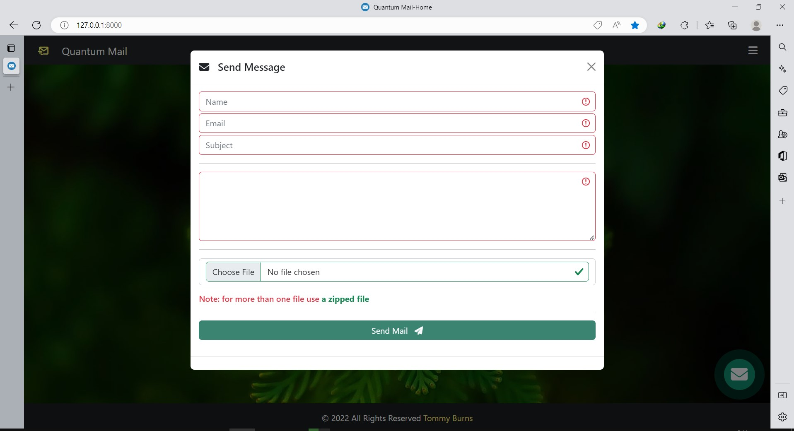
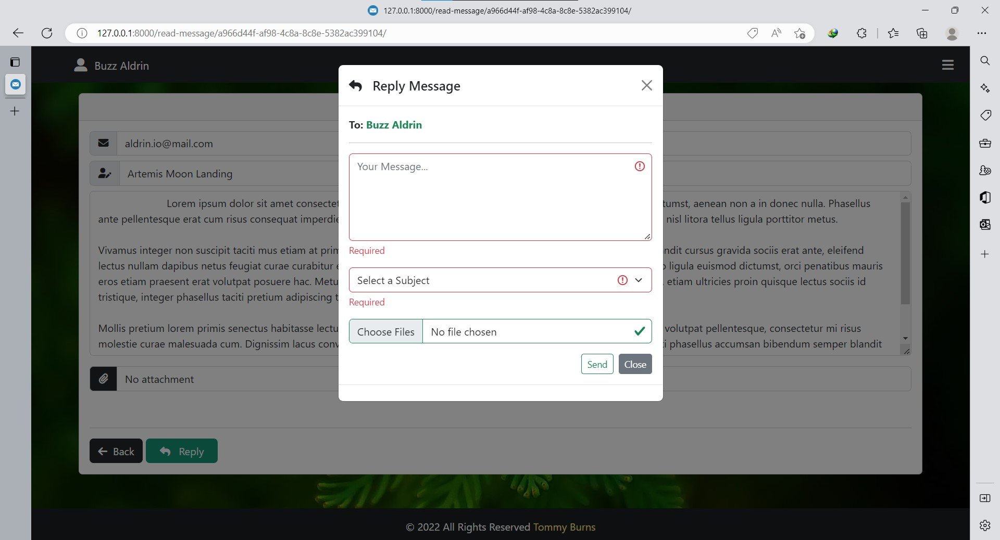

# Django Mail Shop

An Mail Application built with Django **(QMail)**  
 It can be used as an internal mailing system for an organisation to share files and messages.

## The app has the following functionalities

- Beautiful landing page
- Send mail with attachments
- Read, reply and delete mails
- Categorize mails into Read, Unread and Today mails
- Custom 404 and 500 error pages
- Logs the user out after two hours of inactivity
- Beautiful Modal Popups

---

# Below are some screenshots

### Homepage


### Login denied with Popup


### Send Mail



### Inbox


### Read Mail


### Reply Mail



### Custom 404 Page


### Custom 500 Page


### Auto Logout Warning


### Auto Logout


---

```python
print('🎉🎉🎉🎉🎉🎉')
while True:
    if os.path.isfile('manage.py'):
        shell.run(
            "python manage.py runserver"
        )
```

## Author

LinkedIn - [Thomas Burns Botchwey](www.linkedin.com/in/tbbotchwey)

## Credit

[Django Mastery](https://www.youtube.com/@djangomastery)
